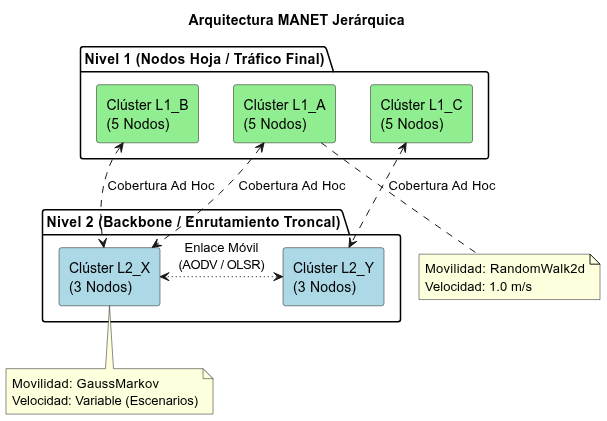
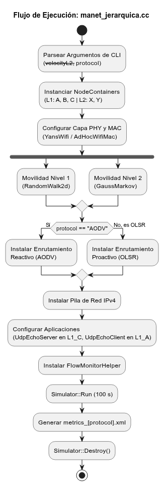

# 03. Diseño de la Solución

## 1. Arquitectura de la Red Jerárquica
El sistema se diseñará utilizando el paradigma orientado a objetos de NS-3, separando la topología en contenedores de nodos (`NodeContainer`).

* **Nivel 1 (Leaf Clusters):**
  * `Cluster_L1_A`: 5 nodos.
  * `Cluster_L1_B`: 5 nodos.
  * `Cluster_L1_C`: 5 nodos.
* **Nivel 2 (Backbone Clusters):**
  * `Cluster_L2_X`: 3 nodos (actúan como pasarelas para A y B).
  * `Cluster_L2_Y`: 3 nodos (actúa como pasarela para C y enlace con X).

## 2. Pila de Protocolos y Enrutamiento
* **Capa Física y MAC:** Se utilizará `YansWifiPhyHelper` y `WifiMacHelper` configurados en modo *Ad Hoc* (802.11) para todos los nodos.
* **Enrutamiento Dinámico:** En lugar de limitar la red a un solo paradigma, la pila de red implementará una inyección condicional de enrutamiento. Dependiendo del escenario de evaluación, se instanciará el protocolo reactivo **AODV** (`AodvHelper`) o el protocolo proactivo **OLSR** (`OlsrHelper`). Esto permitirá contrastar cómo reacciona cada uno a las rupturas de enlaces causadas por la movilidad.
* **Capa de Red:** Asignación de direcciones IPv4 utilizando `Ipv4AddressHelper`. Se asignarán subredes distintas para diferenciar el tráfico intra-clúster del tráfico inter-clúster.

## 3. Diseño de la Movilidad (El núcleo de la indagación)
Para cumplir con el requisito de movimiento dual (nodo y clúster), el diseño aplicará un enfoque de "movilidad relativa":
1. **Movimiento Global del Clúster:** Se asignará un modelo `ConstantVelocityMobilityModel` o `GaussMarkovMobilityModel` a un nodo "virtual" o líder de cada clúster.
2. **Movimiento Local del Nodo:** A los nodos "hoja" se les asignará un `RandomWalk2dMobilityModel` confinado a una caja delimitadora (Bounding Box) que se desplaza dinámicamente siguiendo las coordenadas del nodo líder de su respectivo clúster.

## 4. Integración con ns3-ai y Recolección de Datos
Se utilizará la librería `ns3-ai` para establecer un canal de memoria compartida (*shared memory*) entre el proceso en C++ (NS-3) y el entorno de evaluación en Python.
* **Estado (State):** Velocidad actual de los clústeres de Nivel 2 y topología de conectividad.
* **Métricas Extraídas:** 1. *Throughput* (Kbps) mediante `FlowMonitorHelper`.
  2. *Packet Delivery Ratio* (PDR).
  3. Latencia de extremo a extremo.

## 5. Pseudocódigo Estructural (Flujo Principal)
```cpp
Inicio Simulación
  // 1. Inicializar ns3-ai y parsear parámetros (velocidad, protocolo)
  Inicializar Entorno_AI()
  Leer Argumentos_CLI(velocityL2, protocol)

  // 2. Crear Nodos
  Crear NodeContainers (C1, C2, C3, B1, B2)

  // 3. Configurar Wifi y Canales
  Configurar YansWifiChannel
  Instalar dispositivos NetDevice en los nodos

  // 4. Configurar Movilidad Jerárquica
  Para cada cluster:
      Asignar vector de velocidad global
      Para cada nodo en cluster:
          Asignar RandomWalk relativo al centro del cluster

  // 5. Instalar Pila de Internet y Enrutamiento Dinámico
  Si protocol == "AODV":
      Instalar InternetStack con AodvHelper
  Si protocol == "OLSR":
      Instalar InternetStack con OlsrHelper
  Asignar Subredes IPv4

  // 6. Instalar Aplicaciones de Tráfico
  Configurar OnOffApplication (Tráfico UDP desde Nivel 1 hacia Nivel 1 pasando por Nivel 2)

  // 7. Iniciar FlowMonitor para métricas
  Monitor = FlowMonitorHelper.InstallAll()

  // 8. Correr Simulación (6 escenarios variando velocidad y protocolo)
  Simulator::Stop(100.0 segundos)
  Simulator::Run()

  // 9. Exportar resultados a ns3-ai / XML dinámico
  Exportar_Datos_A("metrics_" + protocol + ".xml")
  Simulator::Destroy()
Fin Simulación
````

## 6\. Diagramas de Arquitectura y Lógica

A continuación se presenta el diagrama de componentes y el diagrama de flujo actualizados para soportar la comparativa de protocolos:

<p align="center"\>
  
</p\>

<p align="center"\>
  
</p\>
